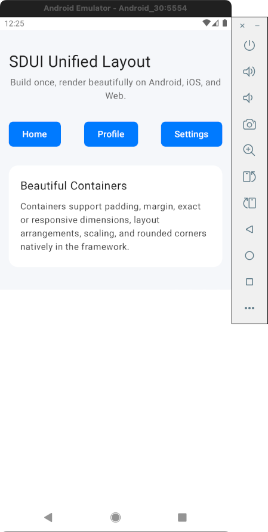
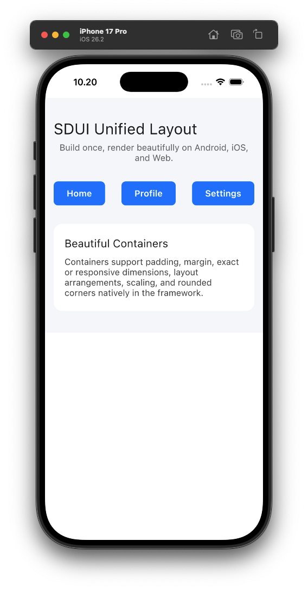
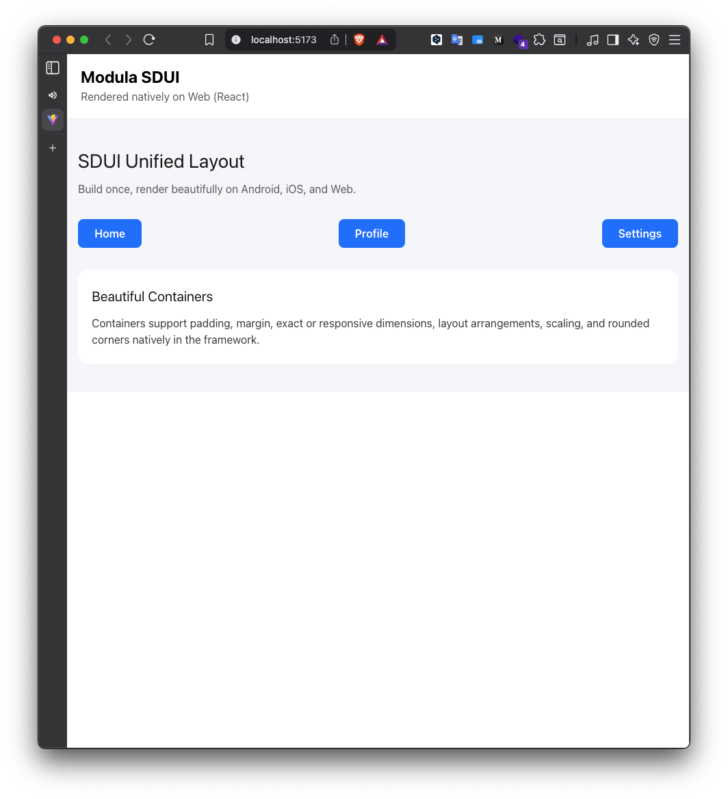
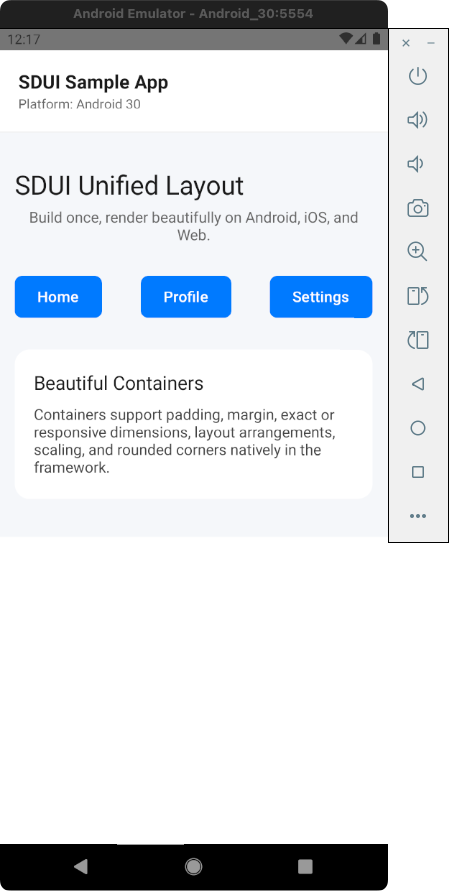
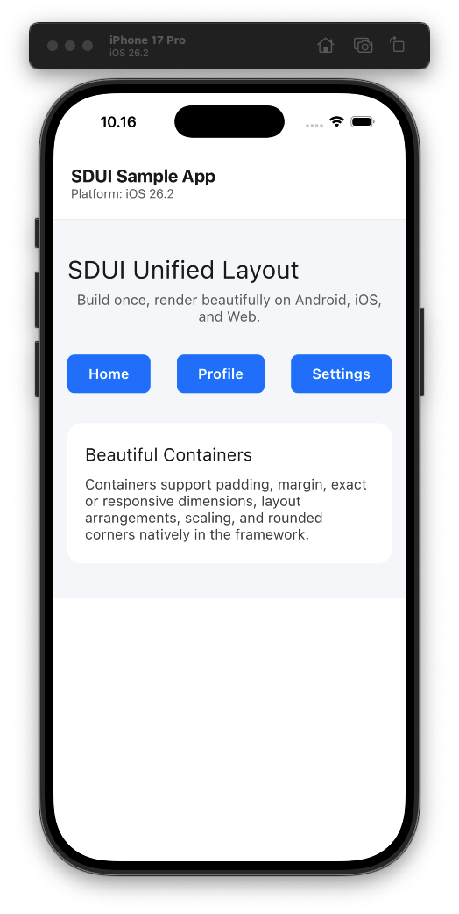

# Modula SDUI SDK (CMP)

MODULA is a modern Server-Driven UI (SDUI) SDK built with **Compose Multiplatform (CMP)**. This solution offers the ultimate code-sharing experience by sharing **100% of both business logic and UI rendering** across Android, iOS, Web, and React Native.

---

## 📱 App Previews

| Android Native | iOS Native | React Web |
| :---: | :---: | :---: |
|  |  |  |

| React Native (Android) | React Native (iOS) |
| :---: | :---: |
|  |  |

---

## 💡 Why CMP?

Unlike traditional cross-platform frameworks, Modula with CMP allows you to write your UI once using Jetpack Compose and deploy it everywhere without losing performance or platform integration.

### The 100/0 Rule
- **100% Shared implementation**: Both the "Smart Brain" (logic) and the "Native Hands" (UI/Mapping) are contained within the shared Kotlin module.
- **Total Consistency**: Ensure your UI looks and behaves exactly the same on every device.
- **Reduced Maintenance**: Fix a bug once, and it's fixed across all your applications.

---

## 🌳 Project Structure

```text
.
├── sdk/                    # 100% Shared Logic & UI (The Core)
│   ├── src/commonMain      # The entire SDK implementation
│   └── build.gradle.kts    # Multiplatform configuration
├── packages/               
│   ├── ios-sdui/           # Reusable Swift Package (ModulaUI)
│   └── react-native-sdui/  # TurboModule bridge for React Native
├── samples/                # Implementation examples
│   ├── android-app/        # Native Android wrapper
│   ├── ios-app/            # Native iOS wrapper (using ModulaUI)
│   ├── react-web-app/      # Vite + React integration
│   └── react-native-app/   # React Native integration
├── scripts/                # Automation & Deployment
│   ├── deploy_sdk.sh       # One-click build and deploy script
│   ├── run_ios.sh          # Build and run native iOS sample
│   ├── run_android.sh      # Build and run native Android sample
│   ├── run_app_ios.sh      # Build and run React Native iOS sample
│   └── run_app_android.sh  # Build and run React Native Android sample
└── README.md
```

---

## 🏗️ Architecture Overview

The CMP version of Modula treats the UI as data that is rendered by a shared engine. 

1. **`sdk/`**: Contains the core logic for parsing SDUI JSON and the Compose UI components that render them.
2. **`packages/react-native-sdui`**: A high-performance bridge that allows React Native developers to drop in Modula components.
3. **`samples/`**: Demonstrates how to integrate the compiled SDK into various host environments.

---

## 🚀 Getting Started

### Prerequisites
- **JDK 17**
- **Android Studio / IntelliJ IDEA**
- **Xcode** (for iOS support)
- **Node.js & Yarn** (for Web/RN support)

### Automated Deployment
To compile the SDK and synchronize it across all projects:

```bash
./scripts/deploy_sdk.sh
```

This script handles:
1. **Android**: Publishing to `mavenLocal`.
2. **iOS**: Compiling the XCFramework.
3. **Web**: Transpiling to JavaScript and packing as an NPM module.
4. **React Native**: Preparing the native binaries for the bridge.

---

## 📱 Running the Samples

We provide automation scripts for each sample to handle dependency syncing and building.

### Native Samples
- **Android**: `./scripts/run_android.sh`
- **iOS**: `./scripts/run_ios.sh`

### React Native Sample
- **Android**: `./scripts/run_app_android.sh`
- **iOS**: `./scripts/run_app_ios.sh`

### Web Sample (React)
```bash
cd samples/react-web-app
npm install
npm run dev
```

---

© 2026 Nostratech Modula. Built with ❤️ using Compose Multiplatform.